<!-- The list of elements -->

<table id="tableofcontents">
  <tr>
    <td width="160px" align="center" class="toc"><a href="index.html">Home</a></td>
    <td width="160px" align="center" class="toc selected"><a href="features.html">Features</a></td>
    <td width="160px" align="center" class="toc"><a href="install.html">Installation</a></td>
    <td width="160px" align="center" class="toc"><a href="faq.html">FAQ</a></td>
    <td width="160px" align="center" class="toc"><a href="dev.html">Development</a></td>
  </tr>
</table>

 
<!-- Until here the list -->

<table>
<tr>
<td>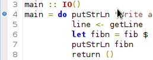</td>
<td valign="center" width="100%">EclipseFP is a complete development environment for Haskell. Syntax highlighting for Haskell and Cabal files is included with the plug-in. The editor contains other features, as tooltips showing the type of the functions you use when you put the mouse over them.</td>
</tr>
</table>
 

<table>
<tr>
<td valign="center" width="100%">Inspect the errors and warnings of your files directly inside the environment. You can also get HLint suggestions for your code. Everything gets checked when you save the file, to save up your time.</td>
<td>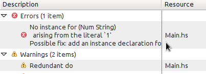</td>
</tr>
</table>
 

<table>
<tr>
<td>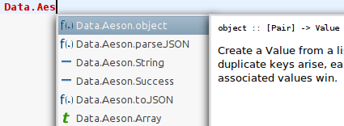</td>
<td valign="center" width="100%">Get full autocompletion when typing your Haskell code. All the information from your installed libraries can be shown at will, helping you to find the correct function or type. Just type <i>Ctrl+Space</i> at any moment to show the completion popup (the key combination can be changed in the Eclipse preferences: <i>General -> Keys -> Content Assist</i>).</td>
</tr>
</table>
 

<table>
<tr>
<td valign="center" width="100%">EclipseFP not only shows the error messages, it also helps you correcting them, showing possible actions to fix the problem. Forgot to add a language pragma to our file? Forgot to add an import or a dependency? Or does your file have redundant imports? These are some of the problems which can be solved automatically.</td>
<td>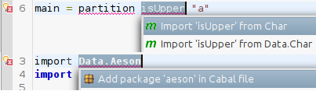</td>
</tr>
</table>
 

<table>
<tr>
<td>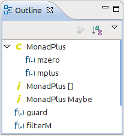</td>
<td valign="center" width="100%">Get fast access to all the definitions in your file with the <i>Outline</i> view. Don't spend lots of time looking for your functions, just go and improve them!</td>
</tr>
</table>
 

<table>
<tr>
<td valign="center" width="100%">Export you Haddock documentation with a single click. In the Haskell editor, you have several shortcuts to improve
your speed when writing Haddock comments.</td>
<td>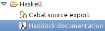</td>
</tr>
</table>
 

<table>
<tr>
<td>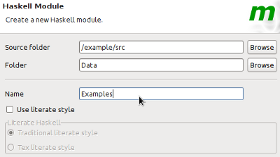</td>
<td valign="center" width="100%">Wizards are the road to being more productive. For example, when creating a new module, let EclipseFP write the module
skeleton for you, and update the Cabal file so your new modules gets added and compiled.</td>
</tr>
</table>
 

<table>
<tr>
<td valign="center" width="100%">EclipseFP alleviates you from the task of maintaining your Cabal files. With the integrated graphical editor,
you can change the most common options directly from a form-like interface.</td>
<td>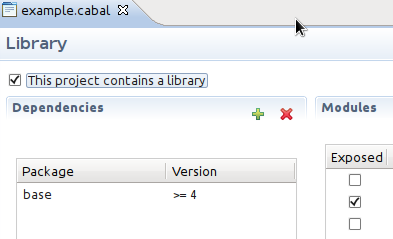</td>
</tr>
</table>
 

<table>
<tr>
<td>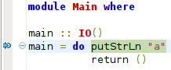</td>
<td valign="center" width="100%">Debug your modules inside Eclipse: set breakpoints, inspect the running program and its variables. EclipseFP
integrates GHCi and its debugging abilities to make your life easier.</td>
</tr>
</table>
 

<table>
<tr>
<td valign="center" width="100%">EclipseFP can run your executables in profile mode and later show a graph of the memory usage. In this way
you don't need to run <code>hp2ps</code> and can manipulate the graph at will.</td>
<td>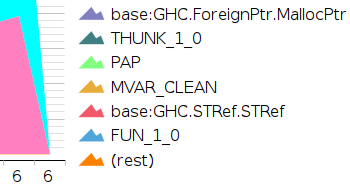</td>
</tr>
</table>
 

<table>
<tr>
<td></td>
<td valign="center" width="100%">The Haskell Browser allows your to navigate your entire collection of packages and modules. Get access to all
the documentation of these modules withing the IDE. Apart from that, EclipseFP integrates the search abilities of Hoogle.</td>
</tr>
</table>
 

<table>
<tr>
<td valign="center" width="100%">Haskell programming is not only coding in Haskell. EclipseFP acknowledges this and includes support for the <a href="http://www.haskell.org/alex/">Alex lexer builder</a>, the <a href="http://www.haskell.org/happy/">Happy parser builder</a> and the <a href="http://www.cs.uu.nl/wiki/HUT/AttributeGrammarSystem">UU Attribute Grammar System</a>. This means that files are precompiled automatically into their Haskell counterparts, special editors are provided and build errors are shown in the editor.
 
Haskell web frameworks like <a href="http://snapframework.com/">Snap</a> and <a href="http://www.yesodweb.com/">Yesod</a> are also supported: you can create web projects directly from the IDE and you will get HTML, CSS or JavaScript highlighting in your templates.
</td>
<td>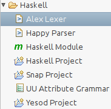</td>
</tr>
</table>
 

<table>
<tr>
<td>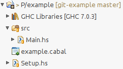</td>
<td valign="center" width="100%">EclipseFP is an Eclipse plug-in, which means that using it you also get access to all the tools for the
Eclipse platform in the same environment: source control providers (such as EGit or Subclipse), task- and bug-oriented interfaces (such as Mylyn)
and a enormous amount of language support.</td>
</tr>
</table>
