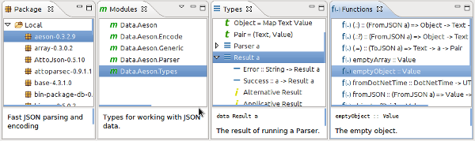

<!-- The list of elements -->

<table style="width: 800px:">
  <tr>
    <td width="160px" align="center" class="toc"><a href="index.html">Home</a></td>
    <td width="160px" align="center" class="toc selected"><a href="features.html">Features</a></td>
    <td width="160px" align="center" class="toc"><a href="install.html">Installation</a></td>
    <td width="160px" align="center" class="toc"><a href="faq.html">FAQ</a></td>
    <td width="160px" align="center" class="toc"><a href="contact.html">Contact</a></td>
  </tr>
</table>

 
<!-- Until here the list -->

<table width="800px">
<tr>
<td></td>
<td valign="center" width="100%">Inspect the errors and warnings of your files directly inside the environment. You can also get HLint suggestions for your code. Everything gets checked when you save the file, to save up your time.</td>
</tr>
</table>
 

<table width="800px">
<tr>
<td valign="center" width="100%">Export you Haddock documentation with a single click. In the Haskell editor, you have several shortcuts to improve
your speed when writing Haddock comments.</td>
<td></td>
</tr>
</table>
 

<table width="800px">
<tr>
<td></td>
<td valign="center" width="100%">Wizards are the road to being more productive. For example, when creating a new module, let EclipseFP write the module
skeleton for you, and update the Cabal file so your new modules gets added and compiled.</td>
</tr>
</table>
 

<table width="800px">
<tr>
<td valign="center" width="100%">EclipseFP alleviates you from the task of maintaining your Cabal files. With the integrated graphical editor,
you can change the most common options directly from a form-like interface.</td>
<td></td>
</tr>
</table>
 

<table width="800px">
<tr>
<td></td>
<td valign="center" width="100%">Debug your modules inside Eclipse: set breakpoints, inspect the running program and its variables. EclipseFP
integrates GHCi and its debugging abilities to make your life easier.</td>
</tr>
</table>
 

<table width="800px">
<tr>
<td valign="center" width="100%">EclipseFP can run your executables in profile mode and later show a graph of the memory usage. In this way
you don't need to run ``hp2ps`` and can manipulate the graph at will.</td>
<td></td>
</tr>
</table>
 

<table width="800px">
<tr>
<td></td>
<td valign="center" width="100%">The Haskell Browser allows your to navigate your entire collection of packages and modules. Get access to all
the documentation of these modules withing the IDE. Apart from that, EclipseFP integrates the search abilities of Hoogle.
   

</td>
</tr>
</table>
 

<table width="800px">
<tr>
<td valign="center" width="100%">EclipseFP is an Eclipse plug-in, which means that using it you also get access to all the tools for the
Eclipse platform in the same environment: source control providers (such as EGit or Subclipse), task- and bug-oriented interfaces (such as Mylyn)
and a enormous amount of language support.</td>
<td></td>
</tr>
</table>
