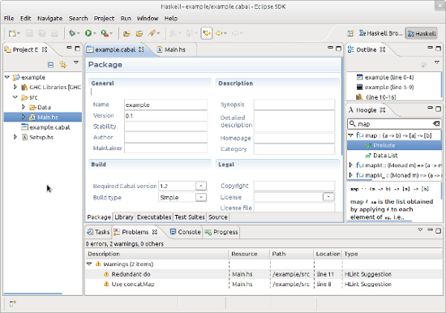

<!-- The list of elements -->

<table id="tableofcontents">
  <tr>
    <td width="160px" align="center" class="toc selected"><a href="index.html">Home</a></td>
    <td width="160px" align="center" class="toc"><a href="features.html">Features</a></td>
    <td width="160px" align="center" class="toc"><a href="install.html">Installation</a></td>
    <td width="160px" align="center" class="toc"><a href="faq.html">FAQ</a></td>
    <td width="160px" align="center" class="toc"><a href="contact.html">Contact</a></td>
  </tr>
</table>

 
<!-- Until here the list -->

<table>
<tr>
<td valign="center" width="230px">
EclipseFP brings you the power of Eclipse to your daily Haskell programming. The features of EclipseFP include:
<ul>
<li>Graphical debugging of modules,</li>
<li>Visual Cabal files editor,</li>
<li>Integration with GHC and HLint to provide error messages and suggestions,</li>
<li>Navigational interfaces for your packages,</li>
<li>and <a href="features.html">many more</a>!</li>
</ul>
If you want to try EclipseFP follow the <a href="install.html">installation instructions</a>.
</td>
<td width="570px" align="center"></td>
</tr>
</table>
 
