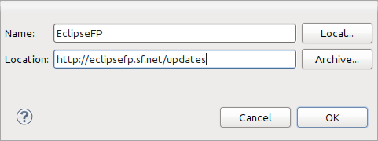
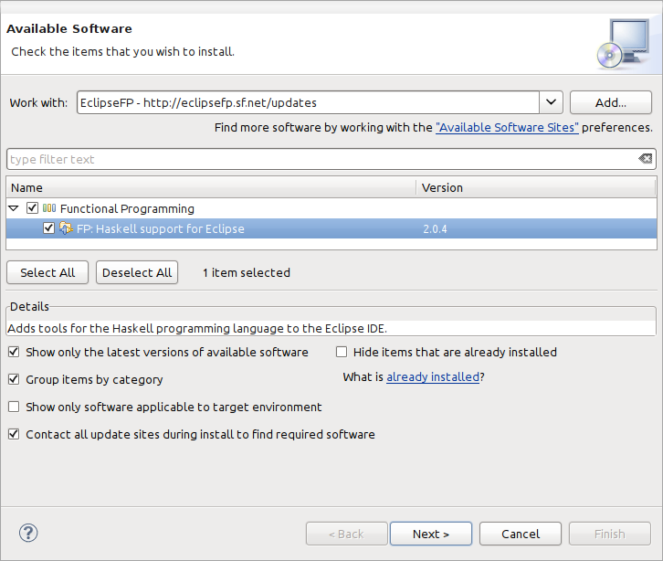

<!-- The list of elements -->

<table id="tableofcontents">
  <tr>
    <td width="160px" align="center" class="toc"><a href="index.html">Home</a></td>
    <td width="160px" align="center" class="toc"><a href="features.html">Features</a></td>
    <td width="160px" align="center" class="toc selected"><a href="install.html">Installation</a></td>
    <td width="160px" align="center" class="toc"><a href="faq.html">FAQ</a></td>
    <td width="160px" align="center" class="toc"><a href="dev.html">Development</a></td>
  </tr>
</table>

 
<!-- Until here the list -->

If are already proficient with Eclipse plug-ins installation, all you need to know is that the Java Development Tools are required and the EclipseFP
update site is located in ``http://eclipsefp.sf.net/updates`` and then follow the <a href="#extra">extra configuration steps</a>. If you don't know what
"update site" means, don't worry, just follow the steps right below this text.
The current version of EclipseFP is 2.3.2.

## Getting Eclipse up and running

If it's the first time that you use Eclipse or install plug-ins, follow this set of instructions:
<ul>
<li>You'll need of course a Java Runtime Environment (JRE), version 6 or above. If you need to download it, go to <a href="http://www.oracle.com/technetwork/java/javase/downloads/index.html">this page</a>.</li>
<li>Go to the <a href="http://eclipse.org/downloads/">Eclipse download page</a> and get any of the Eclipse bundles. With each of them you will get a different initial set of language support, but EclipseFP is compatible only with those with Java support (Eclipse for Java developers, Eclipse for Java EE developers or Eclipse Classic). I recommend you reading some <a href="http://www.eclipse.org/resources/?sort=date&category=Tutorial">Eclipse tutorial</a> and learning about other plug-ins such as <a href="http://eclipse.org/egit/">EGit</a> and <a href="http://www.eclipse.org/mylyn/">Mylyn</a>.</li>
<li>Uncompress the archive you just downloaded. A <code>eclipse</code> folder will be created.</li>
<li>Inside this folder, you will find an executable called <code>eclipse</code>. Double-click it to start the Eclipse environment (yes, "installing Eclipse" means uncompressing it somewhere, even on a portable drive).</li>
<li>The first time you execute Eclipse, you will be asked about a workspace. A <i>workspace</i> is just the folder where your preferences and configurations are stored (you can have different sets of preferences using different workspaces), and where your projects will be created by default. For trying, you can just use the default choice (usually <code>&lt;your user folder&gt;/workspace</code>).</li>
<li>Now, let's install EclipseFP. First, on the menu, go to <b>Help &gt; Install New Software...</b>.</li>
<li>In the <i>Available software</i> window that will appear, click the <b>Add...</b> button.</li>
<li>You will be asked about the details of the update site you want to add. An <i>update site</i> is just a place on the internet where your Eclipse installation can find new plug-ins to install. If you use Linux, the concept is very similar to a repository. The name is not important, but the URL must point to <code>http://eclipsefp.sf.net/updates</code>.
 

</li>
<li>The <i>Available software</i> window will show the plug-ins in the EclipseFP repository. Check <b>FP: Haskell support for Eclipse</b> and click <b>Next</b>.</li>
<li>After clicking <b>Next</b> a few more times (for accepting the licenses), the plug-in will be downloaded and installed.
 

</li>
<li>You will be asked for an Eclipse restart. After doing it, you can start using EclipseFP by going to <b>Window &gt; Open perspective &gt; Other...</b> and selecting <i>Haskell</i>.</li>
<li>There is some help for EclipseFP inside the Eclipse help system. Press F1, or choose <b>Help &gt; Help Contents</b>. The help is available under the title <b>Haskell Plug-in User Guide</b>.</li>
<li>Now, follow the <a href="#extra">extra configuration steps</a></li>
</ul>

<a name="extra">
<h2>Extra configuration steps</h2>
</a>

If you have GHC installed and in your path (for example, by installing the <a href="http://hackage.haskell.org/platform/">Haskell Platform</a> or the corresponding package in your Linux distribution), the first time you start EclipseFP you will be prompted to install BuildWrapper and Scion-browser. Just click install to have them downloaded from Hackage and installed.

After that, other message will appear, telling you that EclipseFP is <i>Rebuilding the package database</i>. That operation will be done every time you start EclipseFP. This rebuilding gathers information about changes in your set of installed packages and downloads the corresponding documentation from the internet (or if no internet is present, tries to build it locally). Of course, the first time this is done a lot of information must be downloaded and process, so it will take its time.

When no message telling about jobs is on your screen, you can start playing with your new shiny EclipseFP :) If more some reason you get an error, check the <a href="faq.html">FAQ</a> or ask in the <a href="dev.html">mailing list</a>.

For some of the features to be available you need to install several additional Haskell programs. To be more concrete:
<ul>
<li>You need to install <a href="http://www.haskell.org/hoogle/">Hoogle</a>, to search functions or types in your installed packages. To get it, run <code>cabal install hoogle</code> in a console. The next time EclipseFP starts, it will detect and configure it for use. On Windows, you may need to install some other binaries for hoogle to work: <a href="http://gnuwin32.sourceforge.net/packages/wget.htm">wget</a>, <a href="http://gnuwin32.sourceforge.net/packages/gzip.htm">gzip</a> and <a href="http://gnuwin32.sourceforge.net/packages/gtar.htm">tar</a>.</li>
<li>If you want <a href="http://community.haskell.org/~ndm/hlint/">HLint</a> to give suggestions for improving your code, install it running 
<code>cabal install hlint</code>. Most HLint suggestions can be automatically applied to your code via Quick Fixes.</li>
<li>EclipseFP can run unit tests created with <a href="http://batterseapower.github.com/test-framework/">Test-framework</a>. You can install it running
<code>cabal install test-framework test-framework-quickcheck2 test-framework-hunit</code> (to be able to use QuickCheck and HUnit tests).</li>
<li>The modules analysis is done using <a href="http://hackage.haskell.org/package/SourceGraph">SourceGraph</a>. Get it executing <code>cabal install SourceGraph</code>. Note that you'll need to have dot installed for the graphs to be generated. You can download dot from <a href="http://graphviz.org/">http://graphviz.org/</a>.</li>
<li>EclipseFP includes support for <a href="http://www.haskell.org/alex/">Alex</a>, <a href="http://www.haskell.org/happy/">Happy</a> and <a href="http://www.cs.uu.nl/wiki/HUT/AttributeGrammarSystem">UUAGC</a>. To be able to build your files and get error and warnings shown, you need to install the corresponding packages doing <code>cabal install alex</code>, <code>cabal install happy</code> and <code>cabal install uuagc</code>.</li>
<li>Projects using <a href="http://snapframework.com/">Snap</a> or <a href="http://www.yesodweb.com/">Yesod</a> web frameworks can be created automatically, but only if those packages are installed. To get them, follow the instructions in their official sites.</li>
</ul>

<h3>Extra Eclipse plug-ins</h3>

For some features, you need to install extra Eclipse plug-ins. EclipseFP can run without them, and will warn you if they are needed. Those plug-ins are:
<ul>
<li><i>BIRT Charting Engine</i>: needed to show profiling output. To install it, follow the same steps of the main installation, but use <code>http://download.eclipse.org/birt/update-site/3.7</code> as update site.</li>
<li><i>Web Platform Tools</i>: needed to highlight and provide autocompletion for web-related files. To install it, follow the same steps of the main installation, but use <code>http://download.eclipse.org/webtools/repository/indigo/</code>as update site.</li>
</ul>

